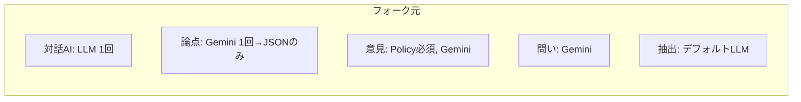
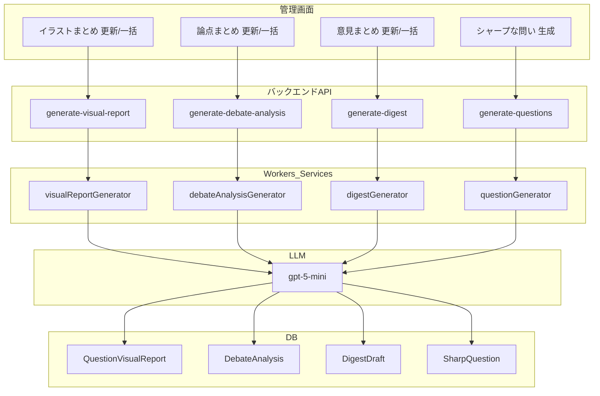
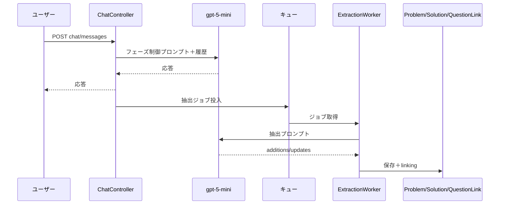

# AI機能：フォーク元（digitaldemocracy2030/idobata）と現行実装の比較

フォーク元: [GitHub - digitaldemocracy2030/idobata](https://github.com/digitaldemocracy2030/idobata)  
比較対象: 対話AI・イラストまとめ・意見まとめ・論点まとめ・課題と解決策・シャープな問いの生成

---

## 1. プロンプトの比較

### 1.1 対話AI（チャット）

| 項目 | フォーク元（upstream） | 現行実装（ローカル） |
|------|------------------------|------------------------|
| **参照** | `legacy-chat-sequence.md` に記載のシステムプロンプト（本番は `chatController.js` 要確認） | `idea-discussion/backend/controllers/chatController.js` |
| **プロンプト方針** | 対話型アシスタント。5W1Hで深掘り、最大4文、課題/解決策の抽出支援、心理的安全性、参考情報（既存の問い）の誘導。 | **フェーズ制御型ファシリテーター**。「課題を解決するアシスタント」ではなく、ユーザー自身が課題・解決策を言語化する進行役。 |
| **構造** | 1. 思考の深掘り 2. 簡潔な応答 3. 課題/解決策の表現ガイド 4. 心理的安全性 5. 話題の誘導 | **Phase 1** 課題の材料収集（質問のみ・要約禁止）→ **Phase 2** 課題の言語化確認（要約提示）→ **Phase 3** 解決アイデア有無確認 → **Phase 4** 解決策の具体化（5W1H）→ **Phase 5** 終了。共通ルール：4文以内・心理的安全性・思考の代行禁止。 |
| **カスタム** | テーマの `customPrompt` があればそれを使用（想定） | `Theme.customPrompt` があれば使用、なければ上記デフォルト。 |
| **モデル** | 未取得（API呼び出しでモデル指定なしの可能性） | `callLLM(llmMessages)` のみ → デフォルト `gpt-5-mini` |

**差分まとめ:** 現行は「フェーズ制御」で段階的に課題→解決策を引き出す設計。フォーク元は従来どおり「深掘り＋抽出支援」の汎用対話に近い。

---

### 1.2 イラストまとめ（Visual Report / イラスト要約）

| 項目 | フォーク元（upstream） | 現行実装（ローカル） |
|------|------------------------|------------------------|
| **参照** | `questionVisualReportGenerator.js`（取得タイムアウトのため未確認） | `idea-discussion/backend/services/questionVisualReportGenerator.js` |
| **プロンプト概要** | 未取得 | グラフィックレコーディング風HTMLインフォグラフィック。カラーパレット（青系）、Zen Maru Gothic、手描き風要素、絵文字、レイアウト（幅375px・高さ1440px以上・margin 0 padding 2px）。ヘッダーに「日付／問い」、フッターに「idobata by DD2030」。 |
| **入力** | 想定: 問い＋課題・解決策のMarkdown | 問い＋QuestionLink経由の課題・解決策（関連度順）。`dateStr` を「今日」でプロンプトに挿入。 |
| **出力** | 想定: HTML | HTML文字列 → `QuestionVisualReport.overallAnalysis` |
| **モデル** | 未取得 | `gpt-5-mini` |

**差分まとめ:** フォーク元の同一ファイルは未取得。現行は日付の明示挿入とデザイン仕様が明文化されている。

---

### 1.3 意見まとめ（Digest Draft / 市民意見レポート）

| 項目 | フォーク元（upstream） | 現行実装（ローカル） |
|------|------------------------|------------------------|
| **参照** | `idea-discussion/backend/workers/digestGenerator.js` | 同上 |
| **前提条件** | **PolicyDraft 必須**。ない場合は `return` しダイジェスト生成しない。 | **PolicyDraft 任意**。あり→政策ベースのプロンプト、なし→問い＋課題・解決策のみのプロンプト。 |
| **システムプロンプト** | 中心的な**重要論点**・問題点・解決策・政策ドラフトを分析し市民向けダイジェスト。ガイドライン1〜10（平易化・全体像・長さ約1/3等）。 | （Policyあり）問い＋問題点・解決策＋政策ドラフトを分析。ガイドライン1〜10に加え、**11. Markdown構造指定**：「市民の意見レポート」を含めない、「問い」セクションを含めない、「まとめ」「主要な課題」見出しを使用。 |
| **ユーザーメッセージ** | 問い・Related Problems/Solutions・Policy Report を渡す。 | Policyあり: 同上。Policyなし: 問い・Related Problems/Solutions のみ。 |
| **出力** | `title`, `content` のJSON。DigestDraft に保存（policyDraftId 必須）。 | 同上。`policyDraftId` は Policy あり時のみ設定、なし時は null。 |
| **モデル** | `google/gemini-2.5-pro-preview-03-25` | `gpt-5-mini` |

**差分まとめ:** 現行は「政策なしでも意見だけまとめる」モードと Markdown 構造の厳密指定を追加。フォーク元は Gemini、現行は OpenAI デフォルト。

---

### 1.4 論点まとめ（Debate Analysis）

| 項目 | フォーク元（upstream） | 現行実装（ローカル） |
|------|------------------------|------------------------|
| **参照** | `idea-discussion/backend/services/debateAnalysisGenerator.js` | 同上 |
| **論点分析プロンプト** | 同一。課題点・解決策から論点・対立軸・合意点・対立点を抽出。JSON形式（axes, agreementPoints, disagreementPoints）。 | 同一。 |
| **後処理** | なし。LLMのJSONをそのまま `DebateAnalysis` に保存。 | **2段階**。(1) 上記JSON取得 (2) **論点レポートHTML生成プロンプト**でカード型・青系デザインのHTMLを生成し `formattedReport` として保存。 |
| **モデル** | `google/gemini-2.5-pro-preview-03-25`（1回） | 論点JSON: `gpt-5-mini`、HTML: `gpt-5-mini`（2回呼び出し） |
| **保存フィールド** | questionId, questionText, axes, agreementPoints, disagreementPoints, sourceProblemIds, sourceSolutionIds, version | 上記に加え **formattedReport**（HTML文字列）。 |

**差分まとめ:** 現行は「論点JSON ＋ 表示用HTML」の2段階と `formattedReport` フィールドを追加。フォーク元は Gemini 1回、現行は OpenAI 2回。

---

### 1.5 課題と解決策（抽出 / Extraction）

| 項目 | フォーク元（upstream） | 現行実装（ローカル） |
|------|------------------------|------------------------|
| **参照** | `idea-discussion/backend/workers/extractionWorker.js` | 同上 |
| **チャット用プロンプト** | 会話履歴・既存抽出課題/解決策・最新ユーザーメッセージ。Instructions と Guidelines（二文構成・良い例/悪い例）。出力: additions / updates のJSON。 | 同一構造。現行は Guidelines の「良い例」「悪い例」がより詳細（複数例）。Rules に「情報不足なら無理に生成しない」を明記。 |
| **インポート用プロンプト** | 単一テキストから Problems/Solutions 抽出。additions のみ（updates なし）。良い例/悪い例は「コメントの背景」「投稿から抽出」等の文言。 | 現行も additions のみ（import では updates なし）。文言・構造はほぼ同一。 |
| **モデル** | `callLLM(..., true)` のみ → デフォルト想定 | 同上（デフォルト `gpt-5-mini`） |

**差分まとめ:** プロンプト本文はほぼ同一。フォーク元は Gemini 混在環境の可能性あり、現行は OpenAI 統一。

---

### 1.6 シャープな問いの生成（SharpQuestion）

| 項目 | フォーク元（upstream） | 現行実装（ローカル） |
|------|------------------------|------------------------|
| **参照** | `idea-discussion/backend/workers/questionGenerator.js` | 同上 |
| **システムプロンプト** | HMW 形式。1–3: 現状・理想を詳細に、手段は示さない。4–6: 「現状は○○だが、それが○○になるのは望ましいだろうか？」。6問、日本語、義務教育レベル。JSON: questions[].question, tagLine, tags。 | 同一。加えて「Consolidate similar problems into broader HMW questions」の一文あり。 |
| **ユーザーメッセージ** | 課題文のリスト＋「現状・理想を詳細に、手段を示さず」等の指示。 | 同一。 |
| **モデル** | `google/gemini-2.5-pro-preview-03-25` | `gpt-5-mini` |
| **保存** | SharpQuestion（questionText + themeId で upsert）、保存後に `linkQuestionToAllItems` | 同一。 |

**差分まとめ:** プロンプトはほぼ同一。フォーク元は Gemini、現行は gpt-5-mini。

---

## 2. データフロー図の比較

### 2.1 フォーク元（upstream）のデータフロー（取得できた範囲）



```
[対話AI]
  ユーザー → POST /themes/:themeId/chat/messages
    → ChatController → LLM（システムプロンプト＋参照情報＋履歴）
    → 応答返却
    → 非同期: ExtractionWorker（課題・解決策抽出）→ Problem / Solution / QuestionLink

[シャープな問い]
  管理画面 → POST /api/themes/:themeId/generate-questions（等）
    → questionGenerator → LLM (Gemini)
    → SharpQuestion upsert → linkQuestionToAllItems

[意見まとめ]
  管理画面 → POST .../generate-digest
    → digestGenerator（PolicyDraft 必須）
    → LLM (Gemini) → DigestDraft 保存

[論点まとめ]
  管理画面 → POST .../generate-debate-analysis
    → debateAnalysisGenerator → LLM (Gemini) 1回
    → DebateAnalysis（axes, agreementPoints, disagreementPoints のみ、HTML なし）

[課題と解決策]
  チャット送信後 非同期
    → ExtractionWorker → LLM（デフォルト想定）→ additions/updates
    → Problem / Solution 保存 → linkItemToQuestions
```

### 2.2 現行実装（ローカル）のデータフロー

```
[対話AI]
  ユーザー → POST /themes/:themeId/chat/messages
    → ChatController（Theme.customPrompt or フェーズ制御プロンプト）
    → LLM (gpt-5-mini) → 応答返却
    → 非同期: ExtractionWorker → Problem / Solution / QuestionLink

[イラストまとめ]
  管理画面 → POST .../generate-visual-report
    → generateVisualReport worker → questionVisualReportGenerator
    → LLM (gpt-5-mini) → HTML
    → QuestionVisualReport.overallAnalysis 保存
  フロント ← GET .../visual-report → IllustrationSummaryContent

[意見まとめ]
  管理画面 → POST .../generate-digest
    → digestGenerator（PolicyDraft あり/なしでプロンプト分岐）
    → LLM (gpt-5-mini) → DigestDraft 保存
  フロント ← digestDraft → OpinionSummaryContent

[論点まとめ]
  管理画面 → POST .../generate-debate-analysis
    → debateAnalysisGenerator
    → LLM (gpt-5-mini) 論点JSON → 続けて LLM (gpt-5-mini) HTML
    → DebateAnalysis（axes, agreementPoints, disagreementPoints, formattedReport）
  フロント ← debateData / formattedReport → DebatePointsContent

[課題と解決策]
  チャット送信後 非同期
    → ExtractionWorker → LLM (gpt-5-mini) → additions/updates
    → Problem / Solution 保存 → linkItemToQuestions

[シャープな問い]
  管理画面 → generate-questions
    → questionGenerator → LLM (gpt-5-mini)
    → SharpQuestion upsert → linkQuestionToAllItems
```

### 2.3 現行実装の全体データフロー（Mermaid）



### 2.4 対話AI＋課題・解決策のデータフロー（現行）



### 2.5 データフロー差分の要約

| 機能 | フォーク元 | 現行 |
|------|------------|------|
| 対話AI | 1回LLM、参照情報＋履歴 | 1回LLM、フェーズ制御 or customPrompt |
| イラストまとめ | 未取得（フローは想定） | worker → service → QuestionVisualReport、日付挿入 |
| 意見まとめ | Policy必須、Gemini 1回 → DigestDraft | Policy任意で分岐、gpt-5-mini 1回、Markdown構造指定 |
| 論点まとめ | Gemini 1回 → JSONのみ | gpt-5-mini 2回（JSON＋HTML）、formattedReport 保存 |
| 課題と解決策 | 非同期・additions/updates、モデル未指定 | 同構造、gpt-5-mini |
| シャープな問い | Gemini → SharpQuestion → linking | gpt-5-mini → 同様 |

---

## 3. モデル利用の比較

| 機能 | フォーク元 | 現行 |
|------|------------|------|
| 対話AI | 未確認（デフォルトの可能性） | gpt-5-mini |
| イラストまとめ | 未取得 | gpt-5-mini |
| 意見まとめ | google/gemini-2.5-pro-preview-03-25 | gpt-5-mini |
| 論点まとめ | google/gemini-2.5-pro-preview-03-25 | gpt-5-mini（2回） |
| 課題と解決策 | デフォルト想定 | gpt-5-mini |
| シャープな問い | google/gemini-2.5-pro-preview-03-25 | gpt-5-mini |

フォーク元は一部で **Gemini** を明示利用。現行は **OpenAI（gpt-5-mini）** に統一されている。

---

## 4. 参照ファイル一覧

- 現行: `AI情報生成と表示構造の確認結果.md`
- 対話シーケンス: `idea-discussion/docs/legacy-chat-sequence.md`
- AI使用ドキュメント: `docs/AI_Usage_Documentation.md`
- フォーク元: https://github.com/digitaldemocracy2030/idobata （chatController / questionVisualReportGenerator は取得タイムアウトのため未参照）
