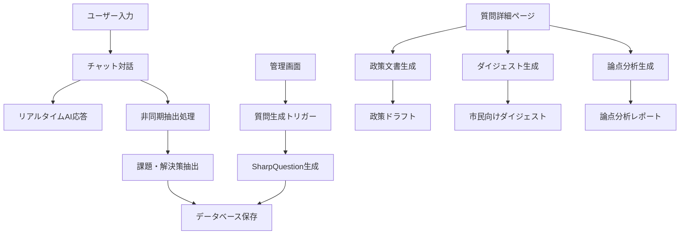

# idobata AI使用状況ドキュメント

## 概要

idobataプロジェクトでは、OpenAI API（主に gpt-5-mini）を使用して、市民参加型の政策議論プラットフォームを構築しています。AIは以下の主要機能で活用されています：

1. **対話型チャット** - ユーザーとのリアルタイム対話
2. **コンテンツ生成** - 質問、政策文書、ダイジェストの自動生成
3. **コンテンツ抽出** - チャットから課題・解決策の自動抽出
4. **分析・レポート** - 論点分析、政策提案の生成

## AI使用の全体像



## 1. 対話型チャット機能

### 使用箇所
- **ファイル**: `idea-discussion/backend/controllers/chatController.js`
- **エンドポイント**: `POST /api/themes/:themeId/chat/message`

### プロンプト設計
```javascript
const systemPrompt = `あなたは、ユーザーが抱える課題やその解決策についての考えを深めるための、対話型アシスタントです。以下の点を意識して応答してください。

1. **思考の深掘り:** ユーザーの発言から、具体的な課題や解決策のアイデアを引き出すことを目指します。曖昧な点や背景が不明な場合は、「いつ」「どこで」「誰が」「何を」「なぜ」「どのように」といった質問（5W1H）を自然な会話の中で投げかけ、具体的な情報を引き出してください。

2. **簡潔な応答:** あなたの応答は、最大でも4文以内にまとめてください。

3. **課題/解決策の抽出支援:** ユーザーが自身の考えを整理し、明確な「課題」や「解決策」として表現できるよう、対話を通じてサポートしてください。

4. **心理的安全性の確保:** ユーザーのペースを尊重し、急かさないこと。論理的な詰め寄りや過度な質問攻めを避けること。

5. **話題の誘導:** ユーザーの発言が曖昧で、特に話したいトピックが明確でない場合、参考情報として提示された既存の問いのどれかをピックアップしてそれについて議論することを優しく提案してください。`;
```

### 特徴
- **モデル**: `gpt-5-mini`（デフォルト）
- **応答形式**: テキスト
- **最大応答長**: 4文以内
- **参考情報**: 既存の課題・解決策をコンテキストとして提供

## 2. SharpQuestion生成機能

### 使用箇所
- **ファイル**: `idea-discussion/backend/workers/questionGenerator.js`
- **エンドポイント**: `POST /api/themes/:themeId/generate-questions`

### プロンプト設計
```javascript
const systemPrompt = `You are an AI assistant specialized in synthesizing problem statements into insightful "How Might We..." (HMW) questions based on Design Thinking principles. Your goal is to generate concise, actionable, and thought-provoking questions that capture the essence of the underlying challenges presented in the input problem statements.

For question 1-3, focus exclusively on describing both the current state ("現状はこう") and the desired state ("それをこうしたい") with high detail. Do NOT suggest or imply any specific means, methods, or solutions in the questions.

For question 4-6, focus on questions in the format 「現状は○○だが、それが○○になるの望ましいだろうか？」. This format is intended to question the validity or desirability of the potential future state itself.

Generate all questions in Japanese language.
All generated text should use language easily understandable by those who has completed compulsory education in Japan.

Respond ONLY with a JSON object containing a single key: "questions".
The value of "questions" should be an array of objects. Each object in the array must contain:
1. "question": A string containing the generated question in Japanese (50-100 characters).
2. "tagLine": A string about 20 characters providing a catchy & easy-to-understand summary.
3. "tags": An array of 2 strings, each being a short, simple word (2-7 characters).

Generate 6 question objects in total within the "questions" array.`;
```

### 特徴
- **モデル**: `gpt-5-mini`
- **応答形式**: JSON
- **生成数**: 6個の質問
- **入力**: テーマに関連する課題（Problem）のリスト
- **重複回避**: `questionText + themeId`でユニーク制約

## 3. コンテンツ抽出機能

### 使用箇所
- **ファイル**: `idea-discussion/backend/workers/extractionWorker.js`
- **トリガー**: チャットメッセージ送信後（非同期）

### プロンプト設計
```javascript
const prompt = `Conversation History:
---
${history}
---

Existing Extracted Problems (for context, focus on user turns below for *new* problems):
---
${existingProblemSummary}
---

Existing Extracted Solutions (for context, focus on user turns below for *new* solutions):
---
${existingSolutionSummary}
---

Latest User Message:
---
${latestUserMessage}
---

Instructions:
Analyze the **latest user message** (marked with [LATEST USER MESSAGE]) in the Conversation History above.
Identify and extract the following, ensuring the output is in **Japanese**:

1. **New Problems:** If a user message introduces a new problem (an unmet need or challenge), describe it. Provide:
   * statement (A concise description of the problem, Japanese)

2. **New Solutions:** If a user message proposes a specific solution or approach, describe it. Provide:
   * statement (The core solution, Japanese)

3. **Updates to Existing Items:** If a user message refines or clarifies an *existing* problem or solution, provide its ID and the updated Japanese statement.

Guidelines for Effective Problem Statements:
- 二文構成で記述する：
  * 一文目：主語を明確にし、「何を」「なぜ」という構造で課題を定義する
  * 二文目：チャットの文脈や背景情報を補足する
- 現状と理想の状態を明確に記述し、そのギャップを問題として定義する
- 具体的な状況と影響を記述し、問題の本質を捉えやすくする
- 解決策の先走りや抽象的な表現を避ける
- 感情的な表現や主観的な解釈を排し、客観的な事実に基づいて記述する

Guidelines for Effective Solution Statements:
- 二文構成で記述する：
  * 一文目：具体的な行動、機能、そしてそれがもたらす価値を明確に記述する
  * 二文目：実装の背景や期待される効果を補足する
- 実現可能性や費用対効果といった制約条件も考慮する
- 曖昧な表現や抽象的な概念を避ける
- 解決策は、課題に対する具体的な応答として提示される`;
```

### 特徴
- **モデル**: `gpt-5-mini`（デフォルト）
- **応答形式**: JSON
- **処理**: 非同期（チャット応答後）
- **出力**: 新しい課題・解決策の抽出、既存項目の更新

## 4. 政策文書生成機能

### 使用箇所
- **ファイル**: `idea-discussion/backend/workers/policyGenerator.js`
- **エンドポイント**: `POST /api/themes/:themeId/questions/:questionId/generate-policy`

### プロンプト設計
```javascript
const systemPrompt = `あなたはAIアシスタントです。中心的な問い（「私たちはどのようにして...できるか？」）、関連する問題点のリスト、そして市民からの意見を通じて特定された潜在的な解決策のリストに基づいて、政策文書を作成する任務を負っています。

あなたの出力は、'content'フィールド内に明確に2つのパートで構成されなければなりません。

Part 1: ビジョンレポート
- 提供された問題点と解決策の意見を分析し、統合してください。
- **現状認識**と**理想像**について、それぞれ**合意点**と**相違点**（トレードオフを含む）を整理してください。
- このパートでは、**どのように解決するか（How）の話は含めず**、課題認識と理想像の明確化に焦点を当ててください。
- 類似したアイデアやテーマをグループ化してください。
- 考慮された問題点と解決策の意見の数を明確に述べてください。
- できる限り具体性が高く、生の声（引用など）を取り入れてください。
- 目標文字数：約7000文字

Part 2: 解決手段レポート
- Part 1で整理された**合意できている理想像**に向けて、提供された解決策の意見を分析・整理してください。
- 理想像を実現するための具体的な解決策を提案してください。
- 類似したアイデアやテーマをグループ化してください。
- 考慮された解決策の意見の数を明確に述べてください。
- 提案が市民のフィードバックに基づいていることを示すために、市民の意見からの特定のテーマや提案の数を参照してください。
- 現実的で具体的な初期草案を作成することに焦点を当ててください。
- 目標文字数：約7000文字

応答は、"title"（文字列、文書全体に適したタイトル）と "content"（文字列、'ビジョンレポート'と'解決手段レポート'の両セクションを含み、Markdownヘッダーなどを使用して明確に区切られ、フォーマットされたもの）のキーを含むJSONオブジェクトのみで行ってください。`;
```

### 特徴
- **モデル**: `gpt-5-mini`
- **応答形式**: JSON
- **出力**: 政策文書（約14,000文字）
- **構成**: ビジョンレポート + 解決手段レポート

## 5. ダイジェスト生成機能

### 使用箇所
- **ファイル**: `idea-discussion/backend/workers/digestGenerator.js`
- **エンドポイント**: `POST /api/themes/:themeId/questions/:questionId/generate-digest`

### プロンプト設計
```javascript
const systemPrompt = `あなたはAIアシスタントです。あなたの任務は、中心的な問い（「私たちはどのようにして...できるか？」）、その問いに関連する問題点と解決策、そして政策ドラフトを分析し、一般市民向けに読みやすく噛み砕いたダイジェストを作成することです。

以下のガイドラインに従ってください：

1. あなたは政策レポートとそのデータを読みこなせる専門家であり、本レポート（digest）はそれを一般人向けに噛み砕くライターである必要があります。政策レポートより平易な表現を使いましょう。

2. 複雑な概念や専門用語を避け、平易な言葉で説明してください。

3. 重要なポイントを強調し、細かい詳細よりも全体像を伝えることに重点を置いてください。

4. なぜこの政策が重要なのか、どのように市民の生活に影響するのかを明確に説明してください。

5. 視覚的に読みやすい構造（見出し、箇条書き、短い段落など）を使用してください。

6. 正確さを保ちながらも、簡潔さを優先してください。

7. 政策提案の背景にある主要な問題や課題を簡潔に説明してください。

8. 専門的な分析や複雑なトレードオフの詳細よりも、政策の目標と期待される成果に焦点を当ててください。

9. 重要な用語やコンセプトを説明するための簡単な例や比喩を含めてください。

10. 全体の長さは元の政策レポートの約1/3に抑えてください。

応答は、"title"（文字列、ダイジェスト全体に適したタイトル）と "content"（文字列、Markdownで適切にフォーマットされた内容）のキーを含むJSONオブジェクトのみで行ってください。`;
```

### 特徴
- **モデル**: `gpt-5-mini`
- **応答形式**: JSON
- **出力**: 市民向けダイジェスト（元の約1/3の長さ）
- **前提**: 既存の政策ドラフトが必要

## 6. 論点分析機能

### 使用箇所
- **ファイル**: `idea-discussion/backend/services/debateAnalysisGenerator.js`
- **エンドポイント**: `POST /api/themes/:themeId/questions/:questionId/generate-debate-analysis`

### プロンプト設計
```javascript
const debatePrompt = `# 論点分析プロンプト

## 目的
以下の課題点と解決策を分析し、主要な論点と対立軸、および合意形成の状況を抽出してください。

## 分析内容
1. 主要な論点と対立軸:
   - 議論における主要な論点を特定し、それぞれの論点における対立する視点や選択肢を明らかにしてください。
   - それぞれの対立軸について、簡潔なタイトルと対立する選択肢（各選択肢には短いラベルと説明文）を提供してください。
   - 3つ以内の重要な対立軸に絞ってください。

2. 合意形成の状況:
   - 合意点: 大多数の意見が一致している点や、広く受け入れられている考え方を特定してください。(3-5項目)
   - 対立点: 意見が分かれている点や、解決されていない論争点を特定してください。(3-5項目)

## 出力形式
JSON形式で以下の構造に従って結果を出力してください:

\`\`\`json
{
  "axes": [
    {
      "title": "対立軸のタイトル",
      "options": [
        {
          "label": "選択肢1のラベル",
          "description": "選択肢1の説明"
        },
        {
          "label": "選択肢2のラベル",
          "description": "選択肢2の説明"
        }
      ]
    }
  ],
  "agreementPoints": [
    "合意点1",
    "合意点2",
    "合意点3",
    "合意点4",
    "合意点5"
  ],
  "disagreementPoints": [
    "対立点1",
    "対立点2",
    "対立点3",
    "対立点4",
    "対立点5"
  ]
}
\`\`\``;
```

### 特徴
- **モデル**: `gpt-5-mini`
- **応答形式**: JSON
- **出力**: 論点分析（対立軸、合意点、対立点）
- **用途**: 議論の構造化と可視化

## AI使用の技術的詳細

### 使用モデル
- **メイン**: `gpt-5-mini`（生成タスク）
- **サブ**: `gpt-5-mini`（対話・抽出タスク）

### エラーハンドリング
- JSON解析失敗時のフォールバック処理
- リトライロジック（実装予定）
- 空レスポンスの検証

### パフォーマンス最適化
- 非同期処理による応答時間短縮
- 重複回避による無駄な処理削減
- 関連度順ソートによる効率的なデータ処理

### セキュリティ
- 環境変数によるAPIキー管理
- 入力検証とサニタイゼーション
- レート制限（実装予定）

## 今後の改善予定

1. **モデル最適化**: タスク別の最適なモデル選択
2. **プロンプト改善**: より一貫性のある出力のためのプロンプトエンジニアリング
3. **エラーハンドリング強化**: より堅牢なエラー処理とリトライ機能
4. **パフォーマンス向上**: キャッシュ機能とバッチ処理の導入
5. **監視・ログ**: AI使用状況の詳細な監視とログ収集

## まとめ

idobataプロジェクトでは、AIを市民参加型の政策議論プラットフォームの中核技術として活用しています。対話、生成、抽出、分析の4つの主要機能を通じて、市民の意見を構造化し、政策立案に活用できる形に変換しています。各機能は独立したプロンプト設計により最適化されており、日本語での自然な対話と高品質な文書生成を実現しています。
